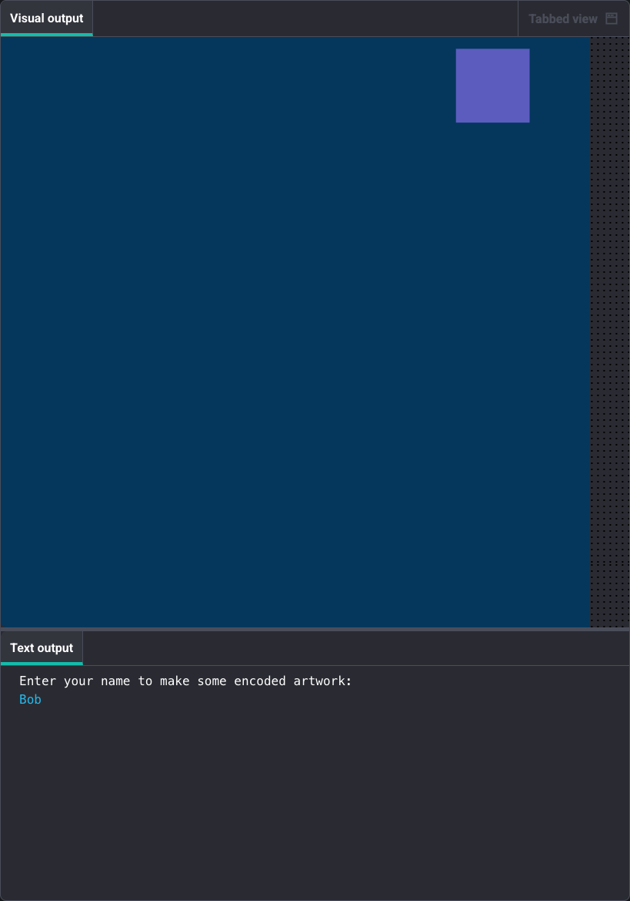

## Use the code dictionary to draw shapes

Expand your encoding dictionary. Add more letters to draw their matching shapes.

Delete these lines.
```
    # Draw one shape from the code
    shape_1(150, primary_1)
```


Add more letters to your encoding. Look them up in the dictionary to draw the correct shape.

```python filename="main.py" line_numbers="true" line_number_start="4" line_highlights="7-8,22-32"
# Define the encoding: each letter maps to [shape name, size, colour]
code = {
    "a": ['shape_1', 150, primary_1],
    "b": ['shape_2', 50, secondary_2],
    "c": ['shape_3', 75, secondary_1],
}

# Get the user's name
print('Enter your name to make some encoded artwork:')
name = input()


# Define the draw function that p5 will call repeatedly
def draw():
    seed(10)  # Generate the same random numbers each time
    no_stroke()
    draw_background()
    
    # Look up the first letter in the code dictionary
    letter = name[0].lower()
    shape_info = code[letter]
    
    # Draw the shape based on what's in the dictionary
    if shape_info[0] == 'shape_1':
        shape_1(shape_info[1], shape_info[2])
    elif shape_info[0] == 'shape_2':
        shape_2(shape_info[1], shape_info[2])
    elif shape_info[0] == 'shape_3':
        shape_3(shape_info[1], shape_info[2])
```

> [!TIP]
>
> - `name[0]` gets the first letter of the name
> - `code[letter]` looks up that letter in the dictionary
> - The `if/elif` statements check which shape to draw
> - Try different first letters (a, b, or c) to see different shapes!

## Now run your code

Each first letter should display as a different shape with the size and colour you encoded!

Try "Alice", "Bob", or "Charlie" to see different shapes.

Run your code, type a name starting with `a`, `b`, or `c`, and check that a different shape appears for each first letter.


