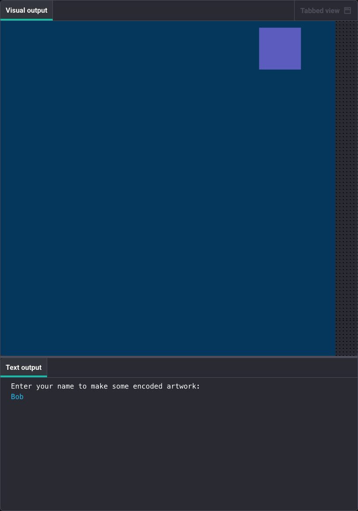

<h2 class="c-project-heading--task">Loop through all letters to build the message</h2>
--- task ---
Add a loop that goes through every letter in the name and builds a list of shapes to draw.
--- /task ---

Add a loop that goes through each letter in the name and builds up a list of all the shapes you need to draw. 

This is the core of the encoding!

Update your draw() function:

--- code ---
---
language: python
filename: main.py
line_numbers: true
line_number_start: 16
line_highlights: 22-38
---
# Define the draw function that p5 will call repeatedly
def draw():
    seed(10)  # Generate the same random numbers each time
    no_stroke()
    draw_background()
    
    name_lower = name.lower()  # Change the input to lowercase
    message = []  # Initialise the message list
    
    for letter in name_lower:
        # Encode each letter with a shape and add it to a list
        if letter in code:
            message.append(code[letter])
    
    # For now, just draw the first shape in the message
    if len(message) > 0:
        shape_info = message[0]
        if shape_info[0] == 'shape_1':
            shape_1(shape_info[1], shape_info[2])
        elif shape_info[0] == 'shape_2':
            shape_2(shape_info[1], shape_info[2])
        elif shape_info[0] == 'shape_3':
            shape_3(shape_info[1], shape_info[2])
--- /code ---

### Tip

The loop builds the message:
- It goes through each letter in the name
- It checks if that letter is in your `code` dictionary
- If it is, it adds the `[shape, size, colour]` information to the `message` list

For now, we're only drawing the first shape - in the next step you'll draw them all!

--- /task ---

--- task ---
**Run your code**

You should still see one shape appear.

Try typing names with different first letters to see different shapes appear.

--- /task ---

