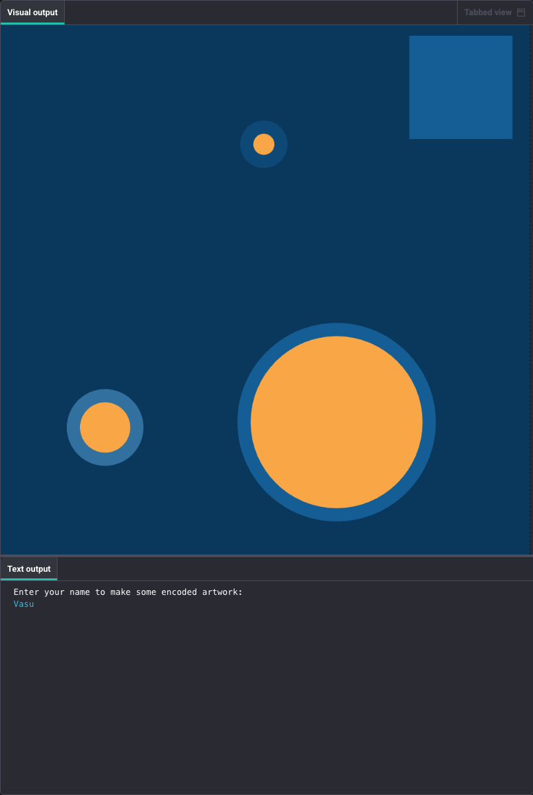

<h2 class="c-project-heading--task">Draw all the shapes and complete the alphabet</h2>
--- task ---
Add a loop to draw ALL the shapes in your message, then complete your encoding with the full alphabet!
--- /task ---

Add a loop to draw every shape in your message list, not just the first one. 

Then complete your encoding with all 26 letters.

Update your draw() function.

--- code ---
---
language: python
filename: main.py
line_numbers: true
line_number_start: 16
line_highlights: 22-38
---
# Define the draw function that p5 will call repeatedly
def draw():
    seed(10)  # Generate the same random numbers each time
    no_stroke()
    draw_background()
    
    name_lower = name.lower()  # Change the input to lowercase
    message = []  # Initialise the message list
    
    for letter in name_lower:
        # Encode each letter with a shape and add it to a list
        if letter in code:
            message.append(code[letter])
    
    # Draw ALL the shapes in the message
    for item in message:  # For each letter, draw the chosen shape
        if item[0] == 'shape_1':
            shape_1(item[1], item[2])
        elif item[0] == 'shape_2':
            shape_2(item[1], item[2])
        elif item[0] == 'shape_3':
            shape_3(item[1], item[2])
--- /code ---

Now complete your `code` dictionary with all letters:

--- code ---
---
language: python
filename: main.py
line_numbers: true
line_number_start: 4
line_highlights: 4-33
---
# Define the encoding: each letter maps to [shape name, size, colour]
code = {
    'a': ['shape_1', 150, primary_1],
    'b': ['shape_2', 50, secondary_2],
    'c': ['shape_3', 75, secondary_1],
    'd': ['shape_2', 80, secondary_1],
    'e': ['shape_1', 20, primary_2],
    'f': ['shape_2', 80, secondary_2],
    'g': ['shape_1', 10, secondary_2],
    'h': ['shape_2', 300, secondary_3],
    'i': ['shape_1', 200, primary_3],
    'j': ['shape_3', 90, secondary_3],
    'k': ['shape_1', 12, complementary_1],
    'l': ['shape_2', 43, complementary_1],
    'm': ['shape_1', 93, complementary_2],
    'n': ['shape_2', 64, complementary_2],
    'o': ['shape_1', 85, primary_4],
    'p': ['shape_2', 10, primary_3],
    'q': ['shape_1', 45, primary_3],
    'r': ['shape_1', 70, primary_4],
    's': ['shape_1', 36, primary_4],
    't': ['shape_3', 74, primary_1],
    'u': ['shape_1', 58, primary_3],
    'v': ['shape_2', 78, primary_1],
    'w': ['shape_1', 24, primary_4],
    'x': ['shape_2', 14, primary_4],
    'y': ['shape_3', 67, secondary_2],
    'z': ['shape_2', 70, complementary_2],
    ' ': ['shape_1', 25, complementary_1],
}
--- /code ---

### Tip

The second loop draws the message:
- It goes through each item in the `message` list
- It checks which shape to draw
- It calls the right shape function with the size and colour

Now all letters are drawn, not just the first one.

--- /task ---

--- task ---
**Run your code**

Now test it with any name or word! 

Type longer names and words - every letter should now be converted to its encoded shape appearing randomly on the screen.

--- /task --- 

